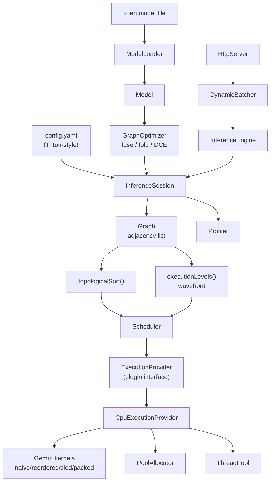
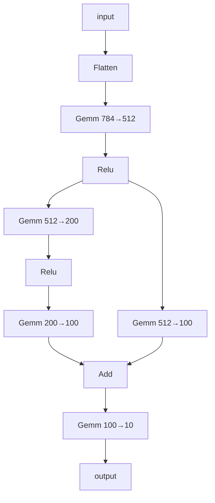

# C++ Inference Engine From Scratch

A CPU inference engine written from scratch in C++17, following Michal Pitr's
[From Scratch](https://michalpitr.substack.com/) series:

1. [Build Your Own Inference Engine: From Scratch to "7"](https://michalpitr.substack.com/p/build-your-own-inference-engine-from) — graph, topological sort, operators
2. [Inference Engine: Optimizing Performance](https://michalpitr.substack.com/p/inference-engine-optimizing-performance) — profiling, killing tensor copies
3. [Inference Engine: Accelerating with CUDA](https://michalpitr.substack.com/p/inference-engine-accelerating-with) — execution providers, memory pool, batching
4. [Optimizing matrix multiplication](https://michalpitr.substack.com/p/optimizing-matrix-multiplication) — loop order, tiling, packing

Plus the parallel branch execution part 1 called out as future work, and the
items from the project's own backlog. Zero external C++ dependencies.

## Results

Accuracy is identical to the PyTorch reference at every setting. Measured on
the full 10,000-image MNIST test set:

| Configuration | Throughput | vs. baseline |
| --- | ---: | ---: |
| Naive GEMM, batch 1, 1 thread | 2,306 /s | 1.0x |
| Reordered loops | 4,771 /s | 2.1x |
| Tiled | 11,033 /s | 4.8x |
| + batching (32) | 33,369 /s | 14.5x |
| + parallel branches, 8 threads | **40,697 /s** | **17.6x** |

```
Samples: 10000    Correct: 9811    Accuracy: 98.1100%
Throughput: 40696.7 inferences/sec
```

Per-node profile at batch 32, showing 98.9% of wall time in real operator work
(the question the profiling post set out to answer):

```
  node          op             calls    total ms     us/call   share
  fc1           GemmRelu         313    137.0313    437.7997 44.5654%
  fc2_left      GemmRelu         313     91.9413    293.7422 29.9012%
  fc2_right     Gemm             313     53.8319    171.9869 17.5072%
  fc2_left2     Gemm             313     17.6250     56.3099  5.7320%
  fc3           Gemm             313      4.6763     14.9403  1.5208%
  flatten       Flatten          313      2.0492      6.5470  0.6664%
  add           Add              313      0.3287      1.0502  0.1069%
  operator time: 307.4837 ms of 310.9228 ms wall (98.8939% useful work, 1.1061% scheduling overhead)
```

## Architecture



| Class | Responsibility |
| --- | --- |
| `Tensor<T>` | Row-major buffer + shape, 64-byte aligned, pluggable allocator |
| `Allocator` / `CpuAllocator` / `PoolAllocator` | Aligned allocation; arena + size-class free lists |
| `Attribute`, `Node` | One operation: op type, tensor names, config |
| `Graph` | Adjacency list; DFS topological sort; wavefront levels |
| `Model`, `ModelLoader` | Graph + weights; `.oien` binary reader/writer |
| `GraphOptimizer` | Activation fusion, constant folding, dead-node elimination |
| `ExecutionProvider` | Plugin interface for backends (ONNX-Runtime style) |
| `CpuExecutionProvider` | CPU kernels, owns the thread pool and memory pool |
| `Gemm` | Five GEMM strategies from the matmul post |
| `ThreadPool` | Inter-op and intra-op parallelism, no nested deadlocks |
| `InferenceSession` | Tensor store, scheduling, copy-free input gathering |
| `InferenceEngine` | Public facade, batch validation |
| `Profiler` | Per-node timings and useful-work share |
| `SessionConfig` | Triton-style config file |
| `DynamicBatcher` | Coalesces queued requests into one forward pass |
| `HttpServer` | Socket server, `/infer` `/health` `/metrics` |

### The model

The blog's branching MNIST classifier — a topology non-trivial enough that
topological ordering actually matters, and that has two genuinely independent
branches:



After optimization and levelling, `inspect` reports:

```
Graph optimization: nodes 9 -> 7 (fused 2, folded 0, eliminated 0)

Execution schedule (6 levels, 1 parallelizable):
  level 0            flatten(Flatten)
  level 1            fc1(GemmRelu)
  level 2 [parallel] fc2_right(Gemm), fc2_left(GemmRelu)
  level 3            fc2_left2(Gemm)
  level 4            add(Add)
  level 5            fc3(Gemm)
```

Level 2 holds exactly the two branches the blog's animation shows racing.

## Parallel execution

Two independent axes, both served by one `ThreadPool`:

- **Inter-op** — nodes are grouped into wavefront levels where level `n` depends
  only on levels `< n`. Every node inside a level is mutually independent, so
  the level runs concurrently. This is the feature part 1 flagged as future work.
- **Intra-op** — a single GEMM shards its output rows across workers.

Nesting is not allowed: `parallelFor` called from a pool worker runs inline, so
a blocked worker can never wait on a task only another worker could run. A level
with one node therefore gets intra-op parallelism; a level with several gets
inter-op parallelism.

Parallel results are bit-identical to sequential ones, which the test suite
asserts over repeated runs.

## Deviations from the blog

The blog's one external dependency is ONNX + protobuf. This implementation
replaces it with **`.oien`**, a compact custom binary format, so the project
builds with nothing but a C++17 compiler and CMake — no `protoc`, no vcpkg, no
system packages. The role is identical: a serialized graph plus weight tensors.

The CUDA execution provider is not implemented (no CUDA toolkit here), but the
`ExecutionProvider` interface it plugs into is, so adding one means adding a
subclass without touching scheduling.

### Additions beyond the blog

- **Wavefront parallel scheduling** (part 1's open question) and intra-op GEMM sharding
- **Graph optimizations**: activation fusion (`Gemm`+`Relu` → `GemmRelu`), constant folding, dead-node elimination
- **Cycle detection** in the topological sort
- **`eval` / `bench` / `inspect` subcommands** — accuracy, latency percentiles, and a full sweep over strategies, batch sizes, and scheduling modes
- **HTTP server + dynamic batching** in C++ (the upstream repo uses a separate Go server), with bounded request sizes and input validation
- **`ModelLoader::save()`** so the format round-trips
- **Dependency-free test suite** — 46 tests via a small self-registering framework

## Build

Requires CMake ≥ 3.15 and any C++17 compiler.

```powershell
cmake -S . -B build -G Ninja -DCMAKE_BUILD_TYPE=Release
cmake --build build
```

## Test

```powershell
.\build\bin\engine_tests.exe
# or: ctest --test-dir build --output-on-failure
```

## Train and export a model

Requires `torch` and `torchvision`.

```powershell
python python/train_mnist.py --epochs 8
python python/export_test_set.py
```

Writes `models/mnist_ffn.oien`, ten sample digits under `inputs/`, and the full
test set as `inputs/mnist_test.bin`.

## Run

```powershell
# single image
.\build\bin\engine_exe.exe run .\models\mnist_ffn.oien .\inputs\image_7.ubyte

# whole test set, batched and parallel
.\build\bin\engine_exe.exe eval .\models\mnist_ffn.oien .\inputs\mnist_test.bin --batch 32 --threads 8 --parallel

# optimization report and parallel schedule
.\build\bin\engine_exe.exe inspect .\models\mnist_ffn.oien

# full optimization sweep
.\build\bin\engine_exe.exe bench .\models\mnist_ffn.oien .\inputs\mnist_test.bin

# per-node profile
.\build\bin\engine_exe.exe eval .\models\mnist_ffn.oien .\inputs\mnist_test.bin --batch 32 --profile
```

Options: `--config <file>` `--batch N` `--threads N` `--gemm naive|reordered|tiled|packed|auto`
`--parallel` `--no-optimize` `--profile`

## Serve

```powershell
.\build\bin\engine_exe.exe serve .\models\mnist.yaml
```

Then, in another terminal:

```powershell
python python/client.py --burst 400
```

```
10/10 correct
400 responses in 0.208s
metrics: requests=410 errors=0 batches=61 average_batch_size=6.72 max_batch_observed=16
```

410 requests coalesced into 61 forward passes by the dynamic batcher.

### Endpoints

| Route | Description |
| --- | --- |
| `POST /infer` | Body is 784 raw uint8 pixels or 784 little-endian float32 values |
| `GET /health` | Liveness probe |
| `GET /metrics` | Request counters and batching statistics |

Request sizes are bounded before allocation, unknown routes are rejected, and
non-finite inputs are refused, so a malformed request cannot drive memory
growth.

## GEMM strategies

`bench` reproduces the matmul post's progression on this workload:

| Strategy | batch 1 | batch 32 |
| --- | ---: | ---: |
| `naive` | 2,306 /s | — |
| `reordered` | 4,771 /s | 5,142 /s |
| `tiled` | 11,033 /s | 14,923 /s |
| `packed` | 2,528 /s | 35,950 /s |
| `auto` | 12,716 /s | 33,369 /s |

`auto` switches to `packed` at batch ≥ 16, which is where the measured crossover
sits. Note `tiled` beating the cache-friendly dot-product path at batch 1: the
blocked kernels skip zero multipliers and MNIST images are roughly 80% black, so
sparsity, not cache behaviour, dominates at small batch.

## The `.oien` format

Little-endian; strings are `u32` length-prefixed UTF-8.

```
magic "OIEN", u32 version
u32 initializer_count
  each: string name, u32 ndim, u64 dims[ndim], f32 data[prod(dims)]
u32 node_count
  each: string name, string op_type,
        u32 n_inputs,  string inputs[n_inputs],
        u32 n_outputs, string outputs[n_outputs],
        u32 n_attrs,   each: string name, u8 tag (0=int64, 1=float, 2=int64[]), value
u32 graph_input_count,  string names[*]
u32 graph_output_count, string names[*]
```

## Layout

Headers live under an `ie/` prefix so includes read as `#include "ie/core/tensor.h"`.
Each module owns its own `CMakeLists.txt`, so adding a file touches exactly one
build script. Test folders mirror the engine modules one-for-one.

```
inference_engine/
  include/ie/
    core/       tensor.h  allocator.h  thread_pool.h
    graph/      attribute.h  node.h  graph.h  graph_optimizer.h
    model/      model.h  model_loader.h
    kernels/    gemm.h  operators.h
    providers/  execution_provider.h  cpu_execution_provider.h  provider_factory.h
    runtime/    config.h  profiler.h  inference_session.h  inference_engine.h
    serving/    dynamic_batcher.h  http_server.h
  src/
    core/ graph/ model/ kernels/ providers/ runtime/ serving/   -> engine_core
    cli/  main.cpp                                              -> engine_exe
tests/
  framework/  test_framework.h  model_fixtures.h  test_main.cpp
  core/ graph/ model/ kernels/ runtime/ serving/
python/       train_mnist.py  export_test_set.py  client.py
models/       mnist.yaml
```

Dependencies point strictly downward:

```mermaid
graph TD
    serving --> runtime
    runtime --> providers
    runtime --> model
    providers --> kernels
    providers --> graph
    graph_opt[graph_optimizer] --> providers
    kernels --> core
    graph --> core
    model --> graph
    model --> core
```

`execution_provider.h` declares only the abstract interface, so code holding an
`ExecutionProvider&` never pulls in any backend's kernels; `cpu_execution_provider.h`
carries the CPU implementation and `provider_factory.h` is the single place a
CUDA backend would be registered.

Build outputs land at `build/bin/` and `build/lib/`.

## Still open

A CUDA execution provider behind the existing interface; pinned-memory and
async transfers; more GEMM work (SIMD intrinsics, L1/L2 tiling levels,
prefetching); quantization; and shape inference to size the tensor pool exactly
at load time.
