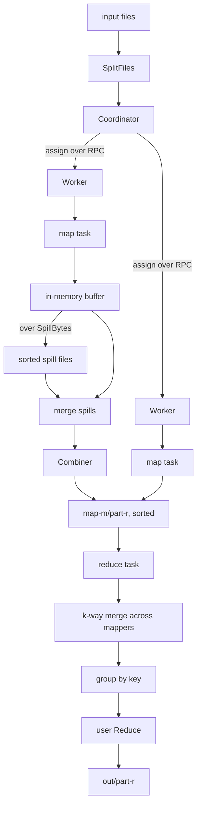

# MapReduce From Scratch

A MapReduce framework in Go, following
[MapReduce from Scratch](https://michalpitr.substack.com/p/mapreduce-from-scratch)
and the [original Dean & Ghemawat paper](https://research.google.com/archive/mapreduce-osdi04.pdf).
You implement `Map` and `Reduce`, fill in a config, and call `Execute`. The
framework handles partitioning, sorting, shuffling, scheduling, and failures.

Standard library only.

## Results

Word count over a 2.4M-word corpus, verified against independently computed
counts:

```
job wordcount-... finished in 1.793s
output: work/wordcount-.../out
  combine.in             2400000
  combine.out            296
  map.emitted            2400000
  map.input_records      200000
  map.output_records     296
  reduce.emitted         37
  reduce.keys            37
  reduce.values          296
```

```
output files: 4
distinct keys: 37 (expected 37)
total words: 2,400,000
every key in exactly one partition: yes
all counts match expected: yes
```

The combiner turned 2,400,000 emitted pairs into 296 records crossing the
map/reduce boundary — an 8,100x reduction in shuffle volume.

## Architecture



| Package | Responsibility |
| --- | --- |
| `interfaces` | `Mapper`, `Reducer`, `Combiner`, `Counters` — the user-facing contract |
| `config` | Job spec, flags, validation |
| `storage` | Job directory layout, atomic writes, input splitting |
| `record` | Key/value wire encoding, partition hashing |
| `merge` | Streaming k-way merge over a min-heap |
| `mapper` | Map task: buffer, spill, sort, combine, partition |
| `reducer` | Reduce task: merge every mapper's partition, group, reduce |
| `coordinator` | Task table, assignment, heartbeats, reassignment, backups |
| `worker` | Pull-based task loop with heartbeating |
| `protocol` | RPC request/reply types |
| `counters` | Per-worker tallies summed across the job |
| `mapreduce` | `Execute` — the single entry point |

## Run modes

One binary plays every role, selected by `-mode`:

| Mode | What it does |
| --- | --- |
| `local` | Coordinator plus in-process worker goroutines. No cluster needed. |
| `cluster` | Coordinator plus worker subprocesses on this host. |
| `coordinator` | Schedule only; wait for workers to dial in. |
| `worker` | Execute tasks from a remote coordinator. |

`coordinator` + `worker` is the topology the blog deploys on Kubernetes, with
the shared work directory as an NFS mount.

## Improvements over the blog

The blog's version launches tasks fire-and-forget and holds all intermediate
data in memory. It names several of these as open problems.

**Fault tolerance.** The coordinator holds the authoritative task table and
workers *pull* work, which is what makes recovery possible:

- a worker that stops heartbeating is declared dead and its tasks requeued
- a task that overruns `-task-timeout` is reassigned
- **backup tasks** for stragglers (paper §3.6), with the losing attempt's late
  report rejected so output is written once
- a task that fails `-max-attempts` times aborts the job instead of retrying
  forever

**Bounded mapper memory.** Mappers spill sorted runs to disk once the buffer
exceeds `-spill-bytes` and merge them at the end, so a map task's memory does
not grow with input size. The blog holds everything in RAM.

**Combiners.** An optional map-side pre-aggregation (paper §4.3). Above, it cut
shuffle volume 8,100x.

**Streaming reduce.** Reduce merges mappers' partitions through a heap and hands
values to the user lazily, so one key with a huge value list never has to fit in
memory.

**Counters** (paper §4.5), atomic output writes so a duplicate or killed task
can't leave a partial file, and job-level validation before any work starts.

## Build and test

```powershell
go build ./...
go test ./... -race
```

## Run the example

Generate a corpus and its expected counts:

```powershell
python python/make_corpus.py --files 40 --lines 5000 --out data/input
go build -o bin/wordcount.exe ./examples/wordcount
```

Single process:

```powershell
.\bin\wordcount.exe -mode local -input data/input -work work -mappers 8 -reducers 4
```

Worker subprocesses on this host:

```powershell
.\bin\wordcount.exe -mode cluster -input data/input -work work -mappers 8 -reducers 4 -workers 4
```

Distributed, in two terminals:

```powershell
.\bin\wordcount.exe -mode coordinator -input data/input -work work -mappers 6 -reducers 3 -addr 127.0.0.1:5340
```

```powershell
.\bin\wordcount.exe -mode worker -addr 127.0.0.1:5340 -work work
```

Verify the output:

```powershell
python python/verify.py --out work/<job-id>/out --expected data/expected.json
```

## Writing a job

```go
type WordCounter struct{}

func (WordCounter) Map(in interfaces.MapInput, emit func(key, value string)) {
    for _, w := range strings.Fields(strings.ToLower(in.Value())) {
        emit(w, "1")
    }
}

type Adder struct{}

func (Adder) Reduce(in interfaces.ReduceInput, emit func(value string)) {
    total := 0
    for !in.Done() {
        n, _ := strconv.Atoi(in.Value())
        total += n
        in.NextValue()
    }
    emit(strconv.Itoa(total))
}

// Optional: the same summing logic, run map-side.
func (Adder) Combine(key string, values []string) []string { ... }

func main() {
    cfg := config.SetupJobConfig()
    cfg.Mapper = WordCounter{}
    cfg.Reducer = Adder{}
    cfg.Combiner = Adder{}
    result, err := mapreduce.Execute(cfg)
}
```

A `Combiner` must be associative and commutative, since it runs an
unpredictable number of times. The test suite asserts that adding one never
changes the answer.

## Options

| Flag | Default | Purpose |
| --- | --- | --- |
| `-mode` | `local` | coordinator, worker, cluster, local |
| `-input` | | input directory |
| `-work` | `work` | shared work directory |
| `-mappers` / `-reducers` | 4 / 2 | task counts |
| `-workers` | NumCPU | workers for local and cluster modes |
| `-addr` | `127.0.0.1:5330` | coordinator address |
| `-spill-bytes` | 32 MiB | mapper buffer before spilling |
| `-task-timeout` | 30s | reassign a task running longer than this |
| `-worker-timeout` | 5s | declare a silent worker dead |
| `-max-attempts` | 4 | abort the job after a task fails this often |
| `-backup-tasks` | true | duplicate stragglers |
| `-backup-threshold` | 1.5 | multiple of median runtime marking a straggler |

## On-disk layout

```
work/<job-id>/
  tmp/                  in-progress writes, renamed into place
  map-<m>/part-<r>      sorted intermediate, one file per reduce partition
  out/part-<r>          final output, one file per reduce task
```

Intermediate and output records are `key<TAB>value` with tabs and newlines
escaped, so a key or value containing either round-trips intact.

## Testing

44 tests. The ones that matter most:

- **combiner equivalence** — same totals with and against without a combiner
- **spill equivalence** — a tiny spill buffer gives the same answer as one pass
- **task-count invariance** — results identical across mapper/reducer counts
- **partition disjointness** — every key lands in exactly one output file
- **fault tolerance** — dead workers, timeouts, backup tasks, rejected late
  reports, and the attempt budget
- **clean shutdown** — a worker whose coordinator vanishes exits zero, so it
  doesn't look like a crashed pod

## Still open

Input splitting is per-file, so one huge file is one map task; splitting on
record boundaries within a file would fix that. There is no coordinator
checkpoint, so losing the coordinator loses the job. Reduce inputs are read
directly from shared storage rather than fetched from mappers, which is what
the shared work directory buys and what a real deployment would replace with a
shuffle service.
